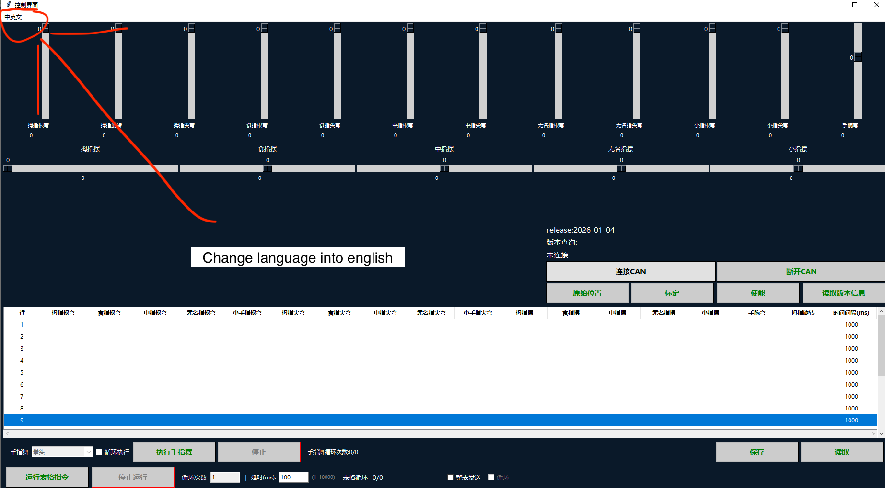
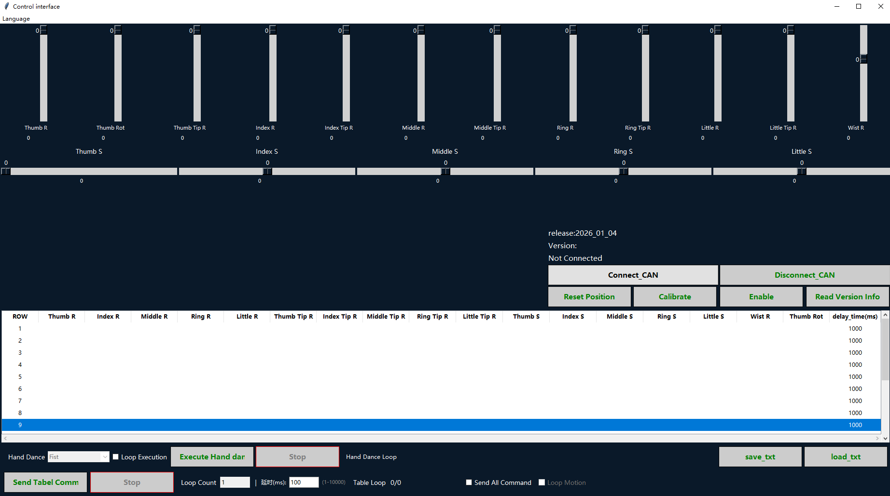
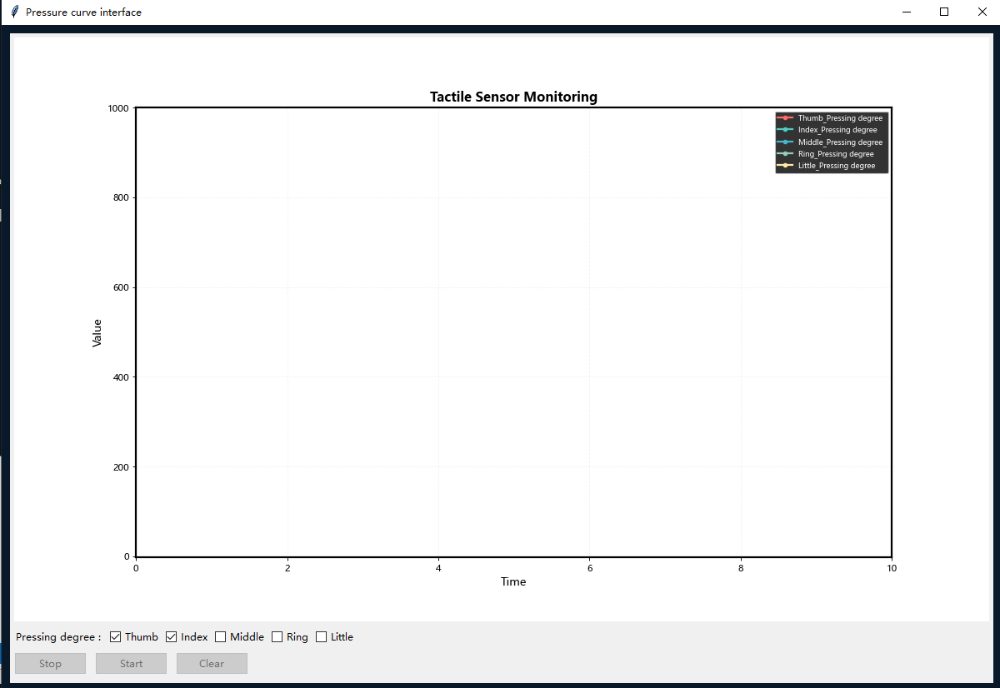

# L30 Windows GUI Application Guide

This guide covers how to use the `l30_hand_ui.exe` Windows application to control and monitor the L30 dexterous hand.

---

## Requirements

- Windows 10 / 11
- L30 hand powered on and connected to the CANFD adapter
- Download the L30 windows App from google drive [Download Here](https://drive.google.com/file/d/1hdMC7-IvHFS5Zt0ZNxPyzpzedDUPhSW_/view?usp=sharing)

---

## Step 1 — Launch the Application

[Download Zip File](https://drive.google.com/file/d/1hdMC7-IvHFS5Zt0ZNxPyzpzedDUPhSW_/view?usp=sharing) for L30 windows applications

Double-click **`l30_hand_ui.exe`** to open the control interface.

The application opens in Chinese by default.



---

## Step 2 — Switch Language to English

Click the **Language** menu in the top-left corner (as indicated by the red arrow in the screenshot above) and select **English**.

The interface will reload in English:



---

## Step 3 — Connect to the Hand

Click **Connect_CAN** to establish the CANFD connection.

Once connected, the status area (center-right) changes from `Not Connected` to the detected device version, e.g.:

```
release: 2026_01_04
Version: x.x.x
```

> If the connection fails, check that the USB-CANFD adapter is plugged in and the hand is powered on.

---

## Interface Overview

### Joint Sliders (top area)

| Slider type | Controls |
|-------------|----------|
| **Vertical sliders** (top row) | Per-finger bend joints — Thumb R, Thumb Rot, Thumb Tip R, Index R, Index Tip R, Middle R, Middle Tip R, Ring R, Ring Tip R, Little R, Little Tip R, Wist R |
| **Horizontal sliders** (below vertical) | Side-swing (abduction/adduction) — Thumb S, Index S, Middle S, Ring S, Little S |

Drag any slider to move the corresponding joint in real time.

### Control Buttons

| Button | Function |
|--------|----------|
| **Connect_CAN** | Open CANFD connection to the hand |
| **Disconnect_CAN** | Close the connection |
| **Reset Position** | Move all joints back to the zero / home position |
| **Calibrate** | Run the joint calibration routine |
| **Enable** | Enable motor drive (required after power-on in some firmware versions) |
| **Read Version Info** | Query and display the hand firmware version |

---

## Action Table (Sequence Programming)

The table in the lower half of the window lets you program a sequence of poses.

Each **ROW** defines one pose with the following columns:

| Column | Description |
|--------|-------------|
| Thumb R / Index R / … | Bend angle for each finger root joint |
| Thumb Tip R / Index Tip R / … | Bend angle for each fingertip joint |
| Thumb S / Index S / … | Side-swing angle for each finger |
| Wist R | Wrist pitch angle |
| Thumb Rot | Thumb rotation |
| delay_time (ms) | How long to hold this pose before moving to the next row |

### Running a Sequence

1. Fill in pose values for each row in the table.
2. Set **Loop Count** and **延时(ms)** (inter-step delay) at the bottom.
3. Click **Send Tabel Comm** to execute the sequence once.
4. To loop the sequence, check **Loop Motion** and click **Send Tabel Comm** again.
5. Click **Stop** to halt execution at any time.

### Saving and Loading Sequences

- **save_txt** — Export the current table to a `.txt` file.
- **load_txt** — Import a previously saved `.txt` sequence file.

---

## Hand Dance (Preset Gestures)

The **Hand Dance** dropdown (bottom-left) provides built-in preset gestures (e.g., `fist`).

- Select a gesture from the dropdown.
- Check **Loop Execution** to repeat it continuously.
- Click **Execute Hand dar** to run it.
- Click **Stop** to stop.

The **Hand Dance Loop** counter shows how many times the gesture has been executed.

---

## Tactile Sensor Monitoring (Pressure View)

If the L30 is equipped with optional tactile (pressure) sensors, a separate **Pressure curve interface** window is available.



### How to use

1. Open the pressure monitoring window from the main UI (or it may open automatically when connected).
2. The chart plots **Pressing degree** (0–1000) over time for up to 5 fingers.
3. Use the checkboxes at the bottom to toggle which fingers are displayed:
   - **Thumb**, **Index**, **Middle**, **Ring**, **Little**
4. Click **Start** to begin streaming sensor data.
5. Click **Stop** to pause, and **Clear** to reset the chart.

### Sensor channels

| Legend color | Finger |
|---|---|
| Red | Thumb |
| Teal | Index |
| Cyan | Middle |
| Green | Ring |
| Yellow-gold | Little |

> The tactile sensor is an optional accessory. If not installed, all values will read 0.

---

## Troubleshooting

| Symptom | Likely cause | Fix |
|---------|-------------|-----|
| `Not Connected` after clicking Connect_CAN | Adapter not found | Check USB connection; verify adapter driver is installed |
| Sliders unresponsive | Motors not enabled | Click **Enable** after connecting |
| All joint values stuck at 0 | Hand not powered | Check power cable and power switch |
| Application crashes on startup | DLL missing or wrong Windows arch | Ensure the vendor CANFD DLL is in the same folder as the `.exe` |
| Pressure chart shows all zeros | Touch sensor not installed or not connected | Verify sensor cable; check `TOUCH` setting |
